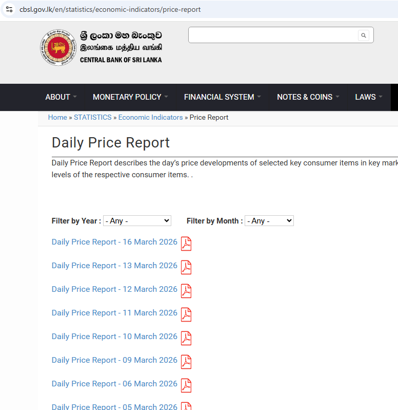
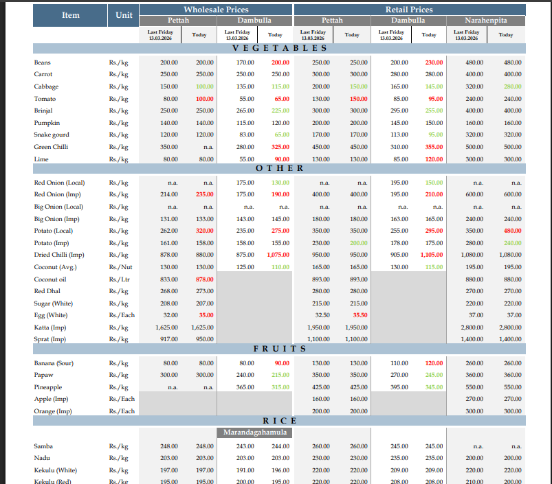
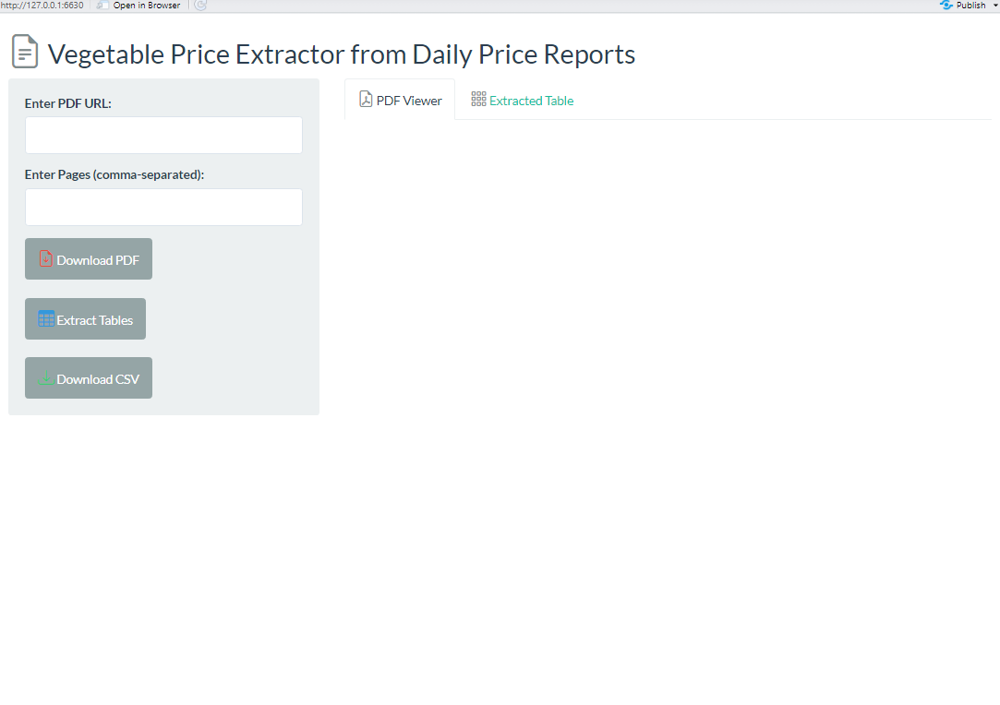

# Introduction

## 

::::: columns
::: {.column width="50%"}
**Key Economic Centres for Vegetables in Sri Lanka:**

Dambulla:

-   Central Province

-   Mainly a supply market.

Pettah (Colombo):

-   Western Province

-   Mainly a demand/retail market.
:::

::: {.column width="50%"}
```{r, out.width="100%"}
knitr::include_graphics("map.png")
```

-   Price fluctuations in Dambulla directly affect Pettah prices due to the supply chain.
:::
:::::

# Data

## Data Source

-   Daily price reports published by the Central Bank of Sri Lanka (CBSL)

-   Link: https://www.cbsl.gov.lk/en/statistics/economic-indicators/price-report

## 

```{r, echo=FALSE, out.width="100%", fig.align='center'}

```

## A Sample Daily Price Reports {.allowframebreaks}

```{r, echo=FALSE, out.width="100%", fig.align='center'}

```

## R package for Web Scrapping Data From Daily Reports

:::::: columns
::: {.column width="70%"}
``` r
# install.packages("pak")
pak::pak("thiyangt/vegscraper")
vegscraper::run_app()
```


:::

::: {.column width="10%"}
:::

::: {.column width="20%"}

:::
::::::

## R Package for Tidy Data

:::::: columns
::: {.column width="70%"}
``` r
# install.packages("pak")
pak::pak("thiyangt/vegetablesSriLanka")
```

```{r, echo=TRUE}
library(vegetablesSriLanka)
data("vegetables.srilanka")
head(vegetables.srilanka, 4)
tail(vegetables.srilanka, 4)
```
:::

::: {.column width="10%"}
:::

::: {.column width="20%"}

:::
::::::

## Vegetables Included in the Analysis

```{r}
unique(vegetables.srilanka$Item)
```

# Pre-processing and Exploratory Data Analysis

## Local View of Data

<https://thiyangt.github.io/vegetableBook/>

## Global View of Data

```{r, echo=TRUE, message=FALSE, warning=FALSE}
library(tidyverse)
features_train_pca <- read_csv("features_train_pca.csv")
colnames(features_train_pca)
```

## Visualisation of Time Series in Feature-space

```{r, echo=FALSE, message=FALSE, warning=FALSE, out.width="100%"}
library(ggplot2)
library(patchwork)

p1 <- ggplot(features_train_pca, aes(x = PC1, y = PC2, color = factor(Type))) +
  geom_point(size = 2) +
  scale_color_brewer(palette = "Set2") +
  theme(
    legend.position = "bottom",
    aspect.ratio = 1
  )+
  labs(title = "Type", x = "PC1", y = "PC2", color = "Type") 
p2 <- ggplot(features_train_pca, aes(x = PC1, y = PC2, color = factor(Market))) +
  geom_point(size = 2) +
  scale_color_manual(values = c("#E41A1C", "#377EB8"))+
  theme(
    legend.position = "bottom",
    aspect.ratio = 1
  ) +
  labs(title = "Market", x = "PC1", y = "PC2", color = "Type")
p3 <- ggplot(features_train_pca, aes(x = PC1, y = PC2, color = Item)) +
  geom_point(size = 2) +
  #scale_color_brewer(palette = "Set2") +
  theme(
    legend.position = "bottom",
    aspect.ratio = 1
  ) +
  labs(title = "Item", x = "PC1", y = "PC2", color = "Type") 
p1|p2|p3
```

# Forecasting

## Benchmark Approaches

-   Naive

-   Snaive

-   SARIMA

-   ETS

-   STL-ETS: STL decomposition is applied to separate trend and seasonal components. Then, ETS is applied to the seasonally adjusted series (original series minus seasonal component) to forecast the underlying trend.

-   STL-ARIMA: STL decomposition is applied to separate trend and seasonal components. Then, ARIMA is applied to the seasonally adjusted series (original series minus seasonal component) to forecast the underlying trend.

## Benchmark Approaches: Forecasting Accuracy (MAPE)

```{r, warning=FALSE, message=FALSE}
library(readr)
library(tidyverse)
library(Metrics)
accuracy_arima <- read_csv("accuracy_arima.csv")
accuracy_ets <- read_csv("accuracy_ets.csv")
accuracy_naive <- read_csv("accuracy_naive.csv")
accuracy_snaive <- read_csv("accuracy_snaive.csv")
accuracy_stlarima <- read_csv("accuracy_stlarima.csv")
accuracy_stlets <- read_csv("accuracy_stlets.csv")
error_rf <- read_csv("mean_errors_rf.csv")
mean_errors_rf <- error_rf |>
  group_by(Item, Type, Market) %>%
  summarise(
    mean_RMSE = mean(mean_RMSE, na.rm = TRUE),
    mean_MAE  = mean(mean_MAE, na.rm = TRUE),
    mean_MAPE = mean(mean_MAPE, na.rm = TRUE)
  )
all <- accuracy_arima |> rename(SARIMA = MAPE)
all$ETS <- accuracy_ets$MAPE
all$NAIVE <- accuracy_naive$MAPE
all$SNAIVE <- accuracy_snaive$MAPE
all$STLARIMA <- accuracy_stlarima$MAPE
all$STLETS <- accuracy_stlets$MAPE
all$RF <- mean_errors_rf$mean_MAPE
all <- all |> select(Item, Type, Market, 
                     SARIMA,
                     ETS,
                     NAIVE,
                     SNAIVE,
                     STLARIMA,
                     STLETS, 
                     RF)
all |> knitr::kable()
```

## Mean MAPE Across All Time Series

```{r}
# Compute column means for numeric columns
col_means <- all %>%
  summarise(across(where(is.numeric), mean, na.rm = TRUE))

# Arrange by ascending mean (optional)
col_means_long <- col_means %>%
  tidyr::pivot_longer(everything(), names_to = "Model", values_to = "Mean") %>%
  arrange(Mean)

# Display nicely with knitr::kable
knitr::kable(col_means_long)
```

## Best Method for Each Series

```{r}
library(dplyr)
library(tidyr)
library(knitr)

# Assuming your tibble is called all_fitted_rf

# Step 1: Pivot longer so all models are in one column
long_fitted <- all %>%
  pivot_longer(
    cols = SARIMA:RF, 
    names_to = "Model", 
    values_to = "MAPE"
  )

# Step 2: For each Item, Type, Market, find the model with the lowest MAPE
best_models <- long_fitted %>%
  group_by(Item, Type, Market) %>%
  slice_min(MAPE, n = 1, with_ties = FALSE) %>%  # pick lowest MAPE
  ungroup()

# Step 3: Display nicely
best_models |> as.data.frame()
```
