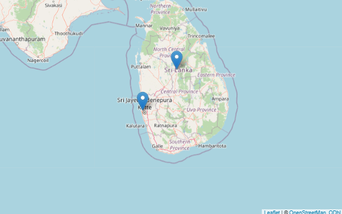

# Introduction

##

:::: {.columns}

::: {.column width="50%"}
**Key Economic Centres for Vegetables in Sri Lanka:**


Dambulla: 

  - Central Province
  
  - Mainly a supply market.

Pettah (Colombo): 

  - Western Province
  
  - Mainly a demand/retail market.
  
:::

::: {.column width="50%"}

```{r, out.width="100%"}

```


- Price fluctuations in Dambulla directly affect Pettah prices due to the supply chain.

:::

::::